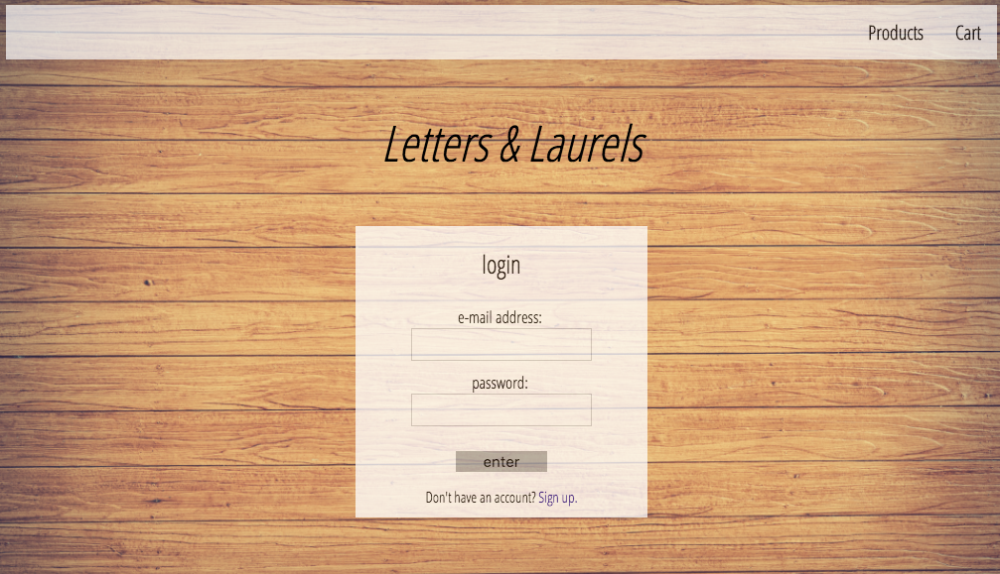
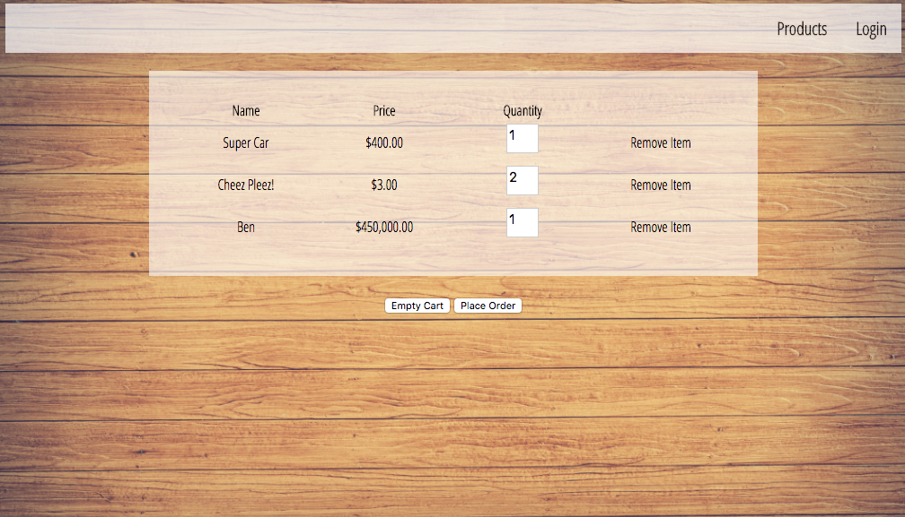

# Inventory Manager

## Note

In order to focus fully on my new coursework at V School, I set this project aside for a time. I plan to complete it after my graduation from V School. Although it is incomplete, I am highlighting it here because it demonstrates valuable learning.

## Objective

Build a front-end CRUD inventory manager application with AngularJS. Include user authentication (sign-up/login), permissions (admin/registered user/unregistered user), a fully functional shopping cart, order placement and history, and the ability to add, remove, and update inventory.

### Login

### Products

### Cart

## Technologies Used

* JavaScript
* AngularJS
* HTML
* CSS
* Heroku API

### Rendering

Use the terminal command `live-server` to render this project in the browser.

